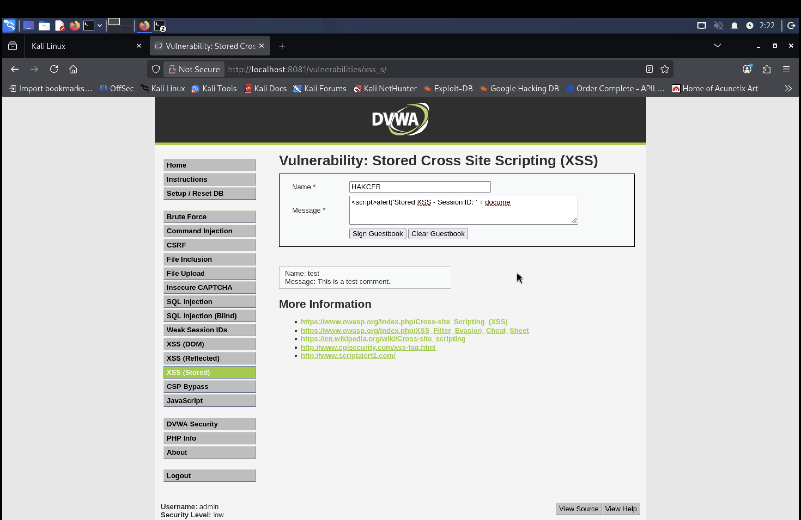
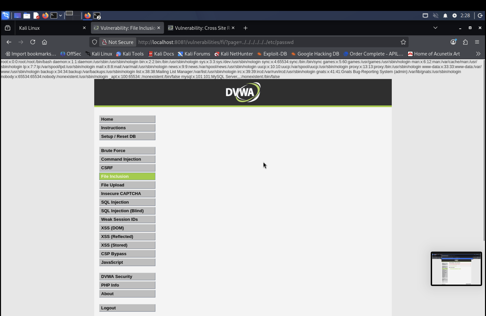

# DVWA Security Testing & Mitigation Lab

## 🛡️ Vulnerability Analysis and Exploitation

### 1. SQL Injection (Task 1)
* **Vulnerability:** SQL Injection via User ID field.
* **Screenshot:** 

### 2. Cross-Site Scripting (Task 2)
* **Vulnerability:** Reflected and Stored XSS.
* **Screenshot:** 

### 3. CSRF (Task 3)
* **Vulnerability:** Cross-Site Request Forgery.
* **Screenshot:** 

### 4. File Inclusion (Task 4)
* **Vulnerability:** Local File Inclusion (LFI).
* **Screenshot:** 

### 5. Burp Suite Intercept (Task 5A)
* **Vulnerability:** Man-in-the-Middle susceptibility.
* **Screenshot:** 

### 6. Burp Suite Fuzzing (Task 5B)
* **Vulnerability:** Brute-force weakness.
* **Screenshot:** %205.png)

### 7. Security Headers (Task 6)
* **Analysis:** Missing critical HTTP security headers.
* **Screenshot:** 
